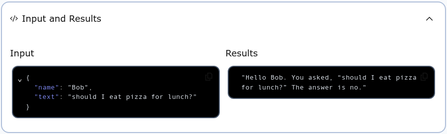

# ZIO-Temporal Activities

In the `HelloWorld` example we built earlier, the Workflow that returns a greeting is purely functional, because it is deterministic.  In other words, the output is completely determined by the input.  If the input is `"Alice"` then the output will be `"Hello Alice!"` every time it is executed.

But most Workflows are non-deterministic.  If you are building a microservice that must communicate with other services and then behave depending on that communication, then a Workflow that includes such communication and behavior must be non-deterministic.  The Workflow is functional in the sense that it has input and output values, but it also has the side-effect of communicating with the outside world.  That communication is not only determining the output value of the Workflow, but it’s also affecting the outside-world in ways that may be unknowable simply by looking at the Workflow code.

Because Tasks that have side-effects such as this are different from purely determistic Workflow Tasks, ZIO-Temporal provides a different mechanism for accomplishing them: [Activities](https://docs.temporal.io/activities).  Activity Tasks are declared, implemented, and used in a manner somewhat similar to Workflow Tasks, we keep them separate and use them a bit differently.

An application that can communicate with other services can provide more features to users by accessing the APIs of those other services and adding value to your program.  Let’s consider a very simple example.

We want to create a service to provide life guidance to users by answering a yes-no question.  We could do it with a random number generator that behaves as digital coin flip, but we want to provide high-quality answers so we will use the API of a service that provides answers in the form of a "yes" or a "no".  Such a service is [YesNo.wtf](https://yesno.wtf) which you can view in your web browser (as of September 2024), but it also has a programmatic API.

The URL for the API is `https://yesno.wtf/api`.  If you pass that as the argument to the `curl` command you will see the form of the value it returns.  Here is an example from one run:

```bash
$ curl https://yesno.wtf/api
{"answer":"yes","forced":false,"image":"https://yesno.wtf/assets/yes/13-c3082a998e7758be8e582276f35d1336.gif"}
```

More prettily formatted, the returned value here was:

```json
{
  "answer": "yes",
  "forced": false,
  "image":  "https://yesno.wtf/assets/yes/13-c3082a998e7758be8e582276f35d1336.gif"
}
```

That’s the output from just one run.  If you run it you will probably get a different result, and run again another result still, because it is non-deterministic.  The result is always a JSON object of the same form.  It has three JSON properties, but the only one we need is the first, named `"answer"`, whose value always either `"yes"` or `"no"`.

We can create a Temporal Activity to do programmatically what we just did using `curl`.  All we need is the ZIO-JSON facility to pull the `"answer"` property out of the result.

In the previous section we wrote a program that takes a person’s name and favorite thing as input, and prints output containing the name and the thing.  We can take that program, and on the input side replace the favorite thing with a question, and on the output side replace the favorite thing with the answer to the question, obtained in response to a request to the `yesno.wtf` API.  This new program will be able to answer any question we give it, as long as the question is a yes-or-no question.

If you open the Scala REPL using the `sbt console` command from the project folder, you can experiment with this interactively.

The Scala standard library’s [`Source`](https://www.scala-lang.org/api/current/scala/io/Source$.html) object provides convenience methods for creatings representations of various sources, including Internet URLs.  The [`fromURL`](https://www.scala-lang.org/api/current/scala/io/Source$.html#fromURL-43f) returns a `Source` instance whose [`mkString`](https://www.scala-lang.org/api/current/scala/io/BufferedSource.html#mkString-0) method returns a string representation of the resource found at the given URL.  You can see this by evaluating the following expression in the REPL console:

```scala
scala> scala.io.Source.fromURL("https://yesno.wtf/api").mkString
val res0: String = {"answer":"no","forced":false,"image":"https://yesno.wtf/assets/no/23-5fe6c1ca6c78e7bf9a7cf43e406fb8db.gif"}
```

To convert this `String` into a usable Scala value, we can define the type of such a value, and generate a decoder using ZIO-JSON:

```scala
scala> case class YesOrNo(answer: String, forced: Boolean, image: String)
     |
// defined case class YesOrNo
```

Now, using ZIO-JSON derive the decoder from the new `Answer` type:

```scala
scala> import zio.json.*
           
scala> given JsonDecoder[YesOrNo] = DeriveJsonDecoder.gen[YesOrNo]
lazy val given_JsonDecoder_YesOrNo: zio.json.JsonDecoder[YesOrNo]
```

The `given` keyword is defining a value, but rather than binding the value to a variable name that we provide, Scala puts the value into the current context so that it is accessible without being named.  The ZIO-JSON method [`fromJson[]`](https://javadoc.io/static/dev.zio/zio-json_3/0.7.3/zio/json/DecoderOps.html#fromJson-f74) will look in the context to find the decoder.  If it finds the decoder and can decode the `String` then it will return the decoded instance of type `YesOrNo`.  If it fails it will return a `String` containing an error message.  Thus, `fromJson[]` will return either a `String` or a `YesOrNo`.

```scala
scala> scala.io.Source.fromURL("https://yesno.wtf/api").mkString.fromJson[YesOrNo]
val res7: Either[String, YesOrNo] = Right(YesOrNo(no,false,https://yesno.wtf/assets/no/14-cb78bf7104f848794808d61b9cd83eba.gif))
```

See that the type returned is `Either[String, YesOrNo]`, which indicates that whatever the value is, it is either a `String` or a `YesOrNo`, but nothing else.  Scala is an object oriented language, and `Either[A, B]` is the supertype of `Left[A, B]` and `Right[A, B]` and nothing else.  If it is `Left[A, B]` then the contained value is an `A`.  If it is a `Right[A, B]` then it contains a `B`.

The expression we evaluated in the REPL returned a value of type `Either[String, YesOrNo]`, so the value will be either a `Left[String, YesOrNo] containing an error-message string, or a `Right[String, YesOrNo] containing the `YesOrNo` that was decoded from JSON.

A Scala `match` expression can destructure a `Left` or `Right`, and extract contents to be returned:

```scala
scala> scala.io.Source.fromURL("https://yesno.wtf/api").mkString.fromJson[YesOrNo] match
     |       case Left(_)                      => "unavailable"
     |       case Right(YesOrNo(answer, _, _)) => answer
     | 
val res3: String = no
```

The expression to the left of the `match` keyword is evaluated, and the returned value is compared to the following patterns until a match is found.  When one pattern matches, the code to the right of the `=>` is evaluated and the result returned.

The expression in the example above above, when evaluated, is making a network connection to the `yesno.wtf` public API, requesting an answer as a JSON-formatted string, attempting to decode that string into an instance of our custom `YesOrNo` type, matching on the value returned by `fromJson[]`, and then, if decoding was successful, returning the `answer` member of that instance.

Follow these links to read more about Scala’s [`match` expressions](https://docs.scala-lang.org/overviews/scala-book/match-expressions.html) and [pattern matching](https://docs.scala-lang.org/tour/pattern-matching.html).

That was the hard part.  Now we can turn this expression into a ZIO-Temporal program by dropping this code into our program.  Because this code has the non-deterministic side-effect of communicating with the outside world, it must be defined as an Activity.  Now we will learn how to define an Activity.

## Declare an Activity

We already learned how to define a Workflow, and defining an Activity is similar.  One difference is that while a Workflow trait declares only a single Workflow method, an Activity trait can declare as many methods as it needs.  These methods can only be executed as part of Workflows.  For example, we can declare a Workflow trait named `AnswerQuestion` whose Workflow method will use an Activity trait named `QuestionActivity`:

```scala
@workflowInterface trait AnswerQuestion:
  @workflowMethod def apply(question: Question): String

@activityInterface trait QuestionActivity:
  def getAnswer(): String
```

The Workflow interface and the Workflow method are annotated as we have seen before.  The Activity trait is annotated with `@activityInterface`.  Although the parentheses after `getAnswer()` are not strictly necessary because the method has no value parameters, we included them to emphasise to human readers that this is a method with side-effects.

The type of a Workflow is the name of its trait type.  This is possible because a Workflow has only one Workflow method, which is the method that starts the Workflow when executed.  A Workflow can have multiple methods, but only one is the “Workflow method”.  If you know the Workflow type then you know the Workflow method.

Activities are different because an Activity trait can declare multiple Activity methods.  Therefore the type of an Activity is the name of its method capitalized, not of the trait that declares that method.  In the example above, the type of the Workflow is `AnswerQuestion` and the type of the Activity is `GetAnswer`.  These names are used in the diagnostic output and the management GUI provided by the Temporal server.

Our main program can execute a Workflow as we have already done, but cannot directly execute an Activity.  An Activity is executed from within a Workflow.  Here is an implementation of the `AnswerQuestion` type declared above, showing how the Workflow method can execute the Activity method:

```scala
class AnswerQuestionImpl extends AnswerQuestion:

  override def apply(question: Question) =
    val answer = ZActivityStub.execute(activity.getAnswer())
    s"Hello ${question.name}. You asked, “${question.text}” The answer is $answer."
```

In the previous section we learned how to use a single custom Scala type as the input parameter to a Workflow, and here we are using one called `Question`.  If we define it as follows, then we can use the `name` and `text` fields as input data for the Workflow.

```scala
case class Question(name: String, text: String)
```

In an earlier sections, we started a Workflow Execution by invoking

```scala
ZWorkflowStub.execute(helloWorld(name))
```

The instruction to start the Activity here is similar, where we invoke:

```scala
ZActivityStub.execute(activity.getAnswer())
```

Here, `activity` is an instance of the Activity trait `QuestionActivity` but *not* an instance of our implementation `QuestionActivityImpl`.  Rather it is an instance of a dynamically-generated proxy class created by the Java Reflection API, which implements our trait `QuestionActivity`.

Similar to the way we obtained a proxy stub for the Workflow object, in this case `activity` is also a proxy stub.  Invoking the `getAnswer()` method on it will start the Temporal process of enqueing a command to start the Activity on the Temporal where a Worker will pick it up and start working on it, and returning its result to our method invocation as if it had been invoked on an instance of `QuestionActivityImpl`.

We obtained the Workflow proxy stub using `ZWorkflowClient.newWorkflowStub[]()`, specifying the Workflow type and options.  Here, we obtain the Activity proxy stub using [`ZWorkflow.newActivityStub[]()`](https://zio-temporal.vhonta.dev/api/zio/temporal/workflow/ZWorkflow$.html#newActivityStub[A](options:zio.temporal.activity.ZActivityOptions)(implicitevidence$3:scala.reflect.ClassTag[A],implicitevidence$4:zio.temporal.activity.IsActivity[A]):zio.temporal.activity.ZActivityStub.Of[A]).

```scala
val activity = ZWorkflow.newActivityStub[QuestionActivity]:
  ZActivityOptions.withStartToCloseTimeout(60.seconds)
```

In order to aquire an Activity proxy stub, you must configure a timeout value, here set to a maximum of sixty seconds for a single attempt of the Activity.  If there are multiple retries, then the total time for the Activity to complete may exceed this single-attempt maximum.

## Register an Activity

A similarity between Workflows and Activities is that both must be registered with a Worker for that Worker to accept and work on them.  A big difference here is that Workflows are registered by type, while Activities are registered by instance value.  We have seen how to register a workflow using the `ZWorker.addWorkflow[]` method.  To register this Activity we will use the [`ZWorker.addActivityImplementation()`](https://zio-temporal.vhonta.dev/api/zio/temporal/worker/ZWorker$.html#addActivityImplementation[Activity%3C:AnyRef](activity:Activity)(implicitevidence$6:zio.temporal.activity.ExtendsActivity[Activity]):zio.temporal.worker.ZWorker.Add[Nothing,Any]) method.

When registering a Workflow, the `addWorkflow[]` method takes a type parameter: the type of the Workflow being registered.  But when registering an Activity, the `addActivityImplementation()` method takes a value parameter, and that value is an instance of the Activity implementation class.  For example, where our Activity implementation class is `QuestionActivityImpl`, we can use the following to register the Activity with a Worker.

```scala
ZWorker.addActivityImplementation(new QuestionActivityImpl)
```

The same as for `addWorkflow[]`, the `addActivityImplementation()` method returns an [aspect](https://stackoverflow.com/questions/242177/what-is-aspect-oriented-programming) that can be applied to a `ZIO` effect.  As we saw before, we apply an aspect to a `ZIO` using the aspect operator `@@`.  This operator returns a `ZIO` and so can be chained like this:

```scala
ZWorkerFactory.newWorker("question-queue")
  @@ ZWorker.addWorkflow[AnswerQuestionImpl].fromClass
  @@ ZWorker.addActivityImplementation(new QuestionActivityImpl)
```

This expression, when evaluated, will return a ZIO effect containing a `ZWorker` instance configured to support both the `AnswerQuestion` Workflow and the `QuestionActivity` Activity.

## Define an Activity

We have declared the `QuestionActivity` Activity trait and its `getAnswer()` Activity method.  Now we must define an implementation.  Here is where we can copy-and-paste the code we developed in the REPL earlier.  That expression, which makes the network request and pattern-matches on the result evaluates to a `String`, and so can be the body of `getAnswer()`:

```scala
class QuestionActivityImpl extends QuestionActivity:
  override def getAnswer(): String =
    Source.fromURL("https://yesno.wtf/api").mkString.fromJson[YesOrNo] match
      case Right(YesOrNo(answer, _, _)) => answer
      case Left(_)                      => "unavailable"
```

Working in the REPL before we used the `given` keyword to create a context variable containing the JSON decoder necessary to deserialize the response from the remote service.  In order to make that decoder available to our program, we must give the definition somewhere where the compiler will know to look.  Since the type the JSON will be decoded into is `YesOrNo`, we can put the decoder definition in the `YesOrNo` companion object:

```scala
case class YesOrNo(answer: String, forced: Boolean, image: String)
object YesOrNo:
  given JsonDecoder[YesOrNo] = DeriveJsonDecoder.gen[YesOrNo]
```

This is everything needed for a working ZIO-Temporal program to answer important yes-or-no questions.  Provision of the dependency-injection we have seen before, and the only change to the library dependencies and imports to to make the ZIO-JSON functionality available.

```scala title="build.sbt"
scalaVersion := "3.4.3"

libraryDependencies ++= Seq(
  "dev.vhonta" %% "zio-temporal-core" % "0.6.1",
  "dev.zio"    %% "zio-json"          % "0.7.3",
  "org.slf4j"   % "slf4j-nop"         % "2.0.16",
)
```

The source code you can arrange however you like.  You can put everything into one file, or split it into multiple files.  We have chosen to use two files for this example.

```scala title="src/main/scala/interfaces.scala"
import zio.*
import zio.json.*
import zio.temporal.*
import zio.temporal.activity.*
import zio.temporal.workflow.*
import scala.io.Source

@workflowInterface trait AnswerQuestion:
  @workflowMethod def apply(question: Question): String

class AnswerQuestionImpl extends AnswerQuestion:

  val activity = ZWorkflow.newActivityStub[QuestionActivity]:
      ZActivityOptions.withStartToCloseTimeout(60.seconds)

  override def apply(question: Question) =
    val answer = ZActivityStub.execute(activity.getAnswer())
    s"Hello ${question.name}. You asked, “${question.text}” The answer is $answer."

@activityInterface trait QuestionActivity:
  def getAnswer(): String

class QuestionActivityImpl extends QuestionActivity:
  override def getAnswer(): String =
    Source.fromURL("https://yesno.wtf/api").mkString.fromJson[YesOrNo] match
      case Right(YesOrNo(answer, _, _)) => answer
      case Left(_)                      => "unavailable"
```

```scala title="src/main/scala/Main.scala"
import zio.*
import zio.json.*
import zio.temporal.*
import zio.temporal.activity.*
import zio.temporal.worker.*
import zio.temporal.workflow.*

case class Question(name: String, text: String)

case class YesOrNo(answer: String, forced: Boolean, image: String)
object YesOrNo:
  given JsonDecoder[YesOrNo] = DeriveJsonDecoder.gen[YesOrNo]

object Main extends ZIOAppDefault:
  val program =
    for
      _ <- ZWorkerFactory.newWorker("question-queue")
             @@ ZWorker.addWorkflow[AnswerQuestionImpl].fromClass
             @@ ZWorker.addActivityImplementation(new QuestionActivityImpl)
      _ <- ZWorkerFactory.setup
      _ <- ZIO.sleep(Duration.Infinity)
    yield ()

  override val run =
    program.provideSome[Scope](
      ZWorkflowClientOptions.make,
      ZWorkflowClient.make,
      ZWorkerFactoryOptions.make,
      ZWorkerFactory.make,
      ZWorkflowServiceStubsOptions.make,
      ZWorkflowServiceStubs.make,
    )
```

## Run the Activity

Now we can see the Activity in action.  As you have done before, make sure the Temporal server is online and available, and then `sbt run` this program.  Then open the [Temporal web GUI](http://localhost:8233/namespaces/default/workflows) in a web browser window.  Go to the "Start Workflow" form as you have done before.  Be sure to enter the correct Task Queue and Workflow Type.  In the Input text box, enter a JSON object that the decoder will be able to deserialize into the Workflow’s input type `Question`.  For example:

```json
{
  "name": "Bob",
  "text": "should I eat pizza for lunch?"
}
```

After starting the Workflow Execution and opening its page you can examine the “Input and Results” section to see your question and its correct answer.



Try the program with different questions as input, and see if it gives better advice than you would get by flipping a coin.
