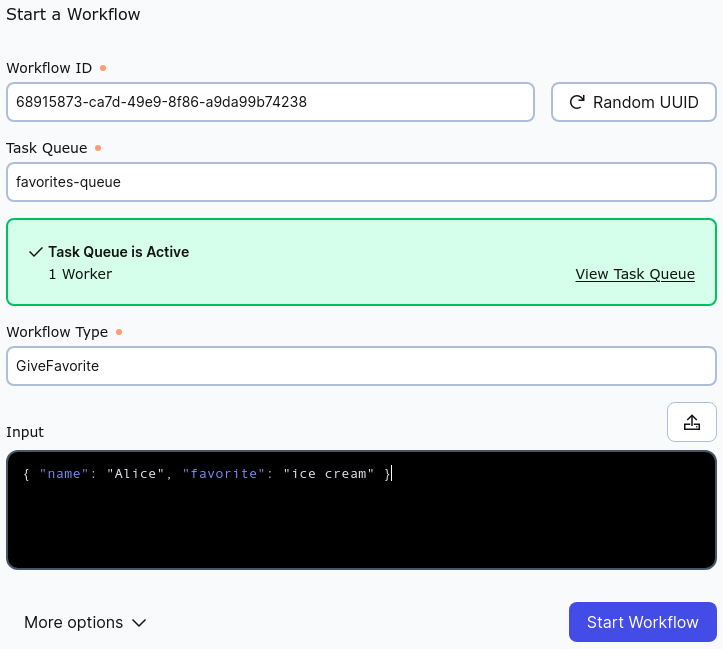
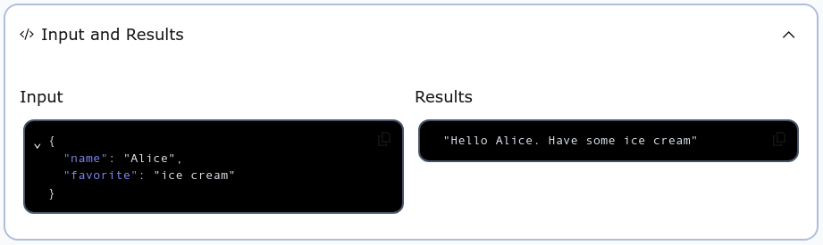

# Passing Complex Workflow Parameters

We have already built a simple “Hello World” ZIO-Temporal application.  Let us make one small change to demonstrate a best practice regarding the type of the input to a Workflow method.

Recall the Workflow method we declared for `HelloWorld` has a single `String` parameter:

```scala
def apply(name: String): String
```

and we invoked it with a single `String` argument`

```scala
ZWorkflowStub.execute(workflowStub("Alice"))
```

This is fine for a first example, but a real application may have more complex input than a single `String`.  Suppose we want to modify our Workflow to use two parameters: (1) the user’s name, and also (2) their favorite stuff.  When run, we want the program print a message like this:

```
Hello Alice. Have some ice cream!
```

We need to provide two `String` values: `Alice` and `ice cream`.  We could change the type signature of the Workflow method like this:

```scala
def apply(name: String, favorite: String): String
```

and invoke the workflow like this:

```scala
ZWorkflowStub.execute(helloWorld("Alice", "ice cream"))
```

There are a number of problems with doing it this way.  For one thing, a Workflow with many parameters can have an unwieldy method signature.  Another problem is that changing the parameters will change the signature which means that all invocations must also be changed.  Even more complicating is the fact that Workflows may be very long running—months or years—and the signature of the Workflow method may change while Workflows are running.

A way to simplify the situation is to declare the Workflow method to have a single parameter of a custom type.  That type can be as complex as we need, and we can change its definition without changing the signature of the method that takes it.  For our simple two-`String` example, we can use a Scala [_product type_](https://en.wikipedia.org/wiki/Product_type), implemented as [`case class`](https://docs.scala-lang.org/tour/case-classes.html#inner-main).

A product type contains one each of a fixed number of values of specified types.  It is called a product type because the total number of possible values is the product of the number of possible values of each member type.  For example, a value of type `Boolean` has two possible values: `true` and `false`.  A product type containing two `Boolean` values has four possible values because four is the product of two times two: `(true, true)`, `(true, false)`, `(false, true)`, and `(false, false)`.  A product type containing a `Boolean` and a `Byte` would have a number of possible values equal to the number of possible `Boolean` values times the number of possible `Byte` values or the _product_ of 2 × 256.

(This is in distinction to a [_sum type_](https://en.wikipedia.org/wiki/Tagged_union), which contains only one of a fixed number of values of any specified types, so the total number of possible values is the sum of the number of possible values of each member’s type.  An example of a sum type in Scala is [`Either`](https://www.scala-lang.org/api/current/scala/util/Either.html).)

Since we want the Workflow method to have two `String` parameters, we can use a single product type with two `String` members, defined like this:

```scala
case class Person(name: String, favorite: String)
```

We can define the Workflow method to have a `Person` as its single parameter and to use it like this:

```scala
def apply(person: Person) =
  s"Hello ${person.name}. Have some ${person.favorite}"
```

So far, so good, but where will the `Person` value come from?  In our previous example program, we entered the `String` as a command-line argument.  In a real program, input will probably be coming from somewhere else: a database or network message for example.  In a microservices architecture, services send and receive messages in some common format, for which JSON is a popular choice.  ZIO-Temporal comes ready to deserialize JSON input into an instance of the `case class` that it represents.

Below is a program for presenting a favorite to a named user.  It is similar to the `HelloWorld` example from the earlier section, but with the following differences:

1. The name of the Task Queue is `"favorites-queue"` instead of `"my-task-queue"`.
2. The Workflow is named `GiveFavorite` instead of `HelloWorld`.
3. The Workflow method has a single value parameter of type `Person`.
4. `Person` is defined as a Scala `case class`.

```scala
import zio.*
import zio.temporal.*
import zio.temporal.worker.*
import zio.temporal.workflow.*

@workflowInterface trait GiveFavorite:
  @workflowMethod def apply(person: Person): String

class GiveFavoriteImpl extends GiveFavorite:
  override def apply(person: Person) =
    s"Hello ${person.name}. Have some ${person.favorite}"

case class Person(name: String, favorite: String)

object Main extends ZIOAppDefault:
  val program =
    for
      worker <- ZWorkerFactory.newWorker("favorites-queue")
                  @@ ZWorker.addWorkflow[GiveFavoriteImpl].fromClass
      _      <- ZWorkerFactory.setup
      _      <- ZIO.sleep(Duration.Infinity)
    yield ()

  override val run =
    program.provideSome[Scope](
      ZWorkflowClientOptions.make,
      ZWorkflowClient.make,
      ZWorkerFactoryOptions.make,
      ZWorkerFactory.make,
      ZWorkflowServiceStubsOptions.make,
      ZWorkflowServiceStubs.make,
    )
```

With the Temporal server up and available, run this program using `sbt run` and then point your browser at [the Temporal web GUI](http://localhost:8233/namespaces/default/workflows).  As you did before, click "Start Workflow", and fill in the form.



Into the Input box, rather than the single `String` argument we used for `HelloWorld`, enter  the JSON representation of the `Person` instance that we want to pass to the Workflow.

```json
{ "name": "Alice", "favorite": "ice cream" }
```

Be certain that the values for "Task Queue" and "Workflow Type" match those in the source code file.  After clicking "Start Workflow", you can click on the Workflow Execution in the list and examine the "Input and Results" section.



The `String` result of the Workflow Execution is what we wanted.  Now you know how to use an arbitrary Scala type as the input parameter for a Temporal Workflow.  You can change the definition of that type without changing the signature of the Workflow method that takes it.

In the next section you will learn how to include Activities in a Workflow.
