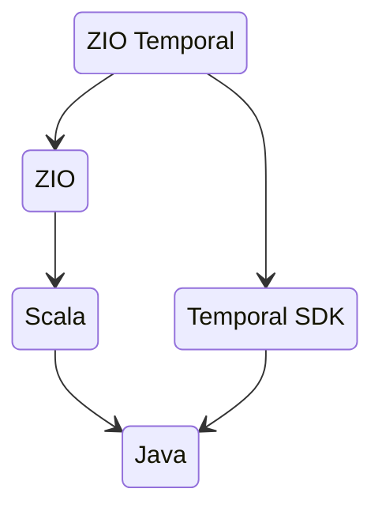
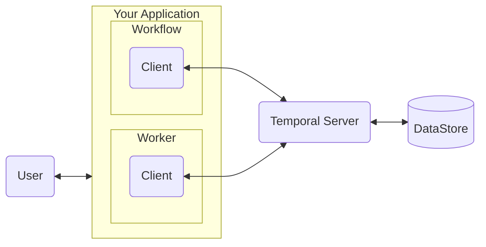

# A ZIO-Temporal Tutorial

## This Tutorial is for Everyone

This section briefly touches on the background knowledge needed to understand the rest of this tutorial.  ZIO-Temporal is build upon Scala, ZIO, and Temporal, so if you are already familiar with these technologies then feel free to skip ahead.  If you find anything confusing in later sections, just come back here and use the links to find more information.  As long as you know something about computer programming and how to type commands at a unix prompt, you should be able to follow along.

The next section makes some detailed recommendations about how to set up a working environment to follow along with the examples, but this section is very general.  Here, we mentions relevant aspects of Scala, ZIO, and Temporal with minimal examples of code.

## The foundations of ZIO-Temporal

ZIO-Temporal is built upon the ZIO library and the Temporal software development kit (SDK).  ZIO is written in Scala, and the Temporal SDK is written in Java.  ZIO-Temporal programs, including all the examples in this tutorial, are written in Scala, and when compiled run on the Java Virtual Machine (JVM).



## Scala

For a deeper introduction to the Scala language see the [online Scala Book](https://docs.scala-lang.org/scala3/book/introduction.html).  For API reference see the documentation for the [Scala standard library](https://www.scala-lang.org/api/current/scala/Predef$.html#println-fffff71f) and the [Java standard library](https://docs.oracle.com/en/java/javase/17/docs/api/java.base/java/lang/String.html).

The following are features of Scala needed to understand the tutorial examples.  Use the links to read more about anything unclear.

Scala is [object oriented](https://docs.scala-lang.org/tour/tour-of-scala.html#scala-is-object-oriented), similar to Java.  Abstract interfaces can be declared as [`trait`](https://docs.scala-lang.org/tour/traits.html#defining-a-trait) and object classes as [`class`](https://docs.scala-lang.org/tour/classes.html#defining-a-class).  Using the `override` keyword when implementing an abstract trait member is optional, but helps to catch errors.  The method name `apply()` in a class definition is special: if you apply parentheses surrounding any number of values to a variable, Scala transforms the code into an invocation of a method named `apply()` on that variable.  Any Scala class can have a [companion object](https://docs.scala-lang.org/scala3/book/domain-modeling-tools.html#companion-objects), which is a singleton objects where [context values](https://docs.scala-lang.org/tour/implicit-parameters.html) for instances of the class can be given.

Scala is [functional](https://docs.scala-lang.org/tour/tour-of-scala.html#scala-is-functional), and functions are objects that [can be passed as arguments and returned as values](https://docs.scala-lang.org/tour/higher-order-functions.html).  Functions and methods, including class constructors, can have both value parameters and type parameters.  Scala’s [pattern matching](https://docs.scala-lang.org/tour/pattern-matching.html#inner-main) is influenced by [ML](https://en.wikipedia.org/wiki/ML_(programming_language)), including [destructuring](https://docs.scala-lang.org/tour/extractor-objects.html#inner-main).

[Scala is statically typed](https://docs.scala-lang.org/tour/tour-of-scala.html#scala-is-statically-typed) and every value has a type.  Thanks to [type inference](https://docs.scala-lang.org/tour/type-inference.html#inner-main) most type annotations are omitted from the examples in this tutorial, but you may find it helpful to use them in your own code.  A [type annotation is written](https://docs.scala-lang.org/style/types.html#annotations) following the expression or assignment-target to which it applies, separated by a colon character (`:`).  Scala has different [kinds](https://en.wikipedia.org/wiki/Kind_(type_theory)) of types, including [higher kinds](https://docs.scala-lang.org/style/naming-conventions.html#higher-kinds-and-parameterized-type-parameters) with generic type parameters.  Scala has [intersection types](https://docs.scala-lang.org/scala3/book/types-intersection.html), which represent values of more than one type, written using the `&` operator, for example `String & Int`.  Scala supports [algebraic data types](https://stackoverflow.com/questions/44991429/what-is-an-algebraic-data-type-adt#answer-52661350).  A [`case class`](https://docs.scala-lang.org/tour/case-classes.html) is a [product type](https://en.wikipedia.org/wiki/Product_type), and [`Either[A,B]`](https://www.scala-lang.org/api/current/scala/util/Either.html) is a [sum type](https://en.wikipedia.org/wiki/Tagged_union).  `Unit`(https://www.scala-lang.org/api/current/scala/Unit.html) is a type of which there is only one value, which is written `()`.  Returning the `Unit` value from a function is useful for indicating that the function returned while providing no further information.

Scala functions can accept arguments passed by value or by name.  By-value arguments are evaluated at the call site and the function receives the value, which it can use repeatedly without re-evaluation.  [By-name arguments](https://docs.scala-lang.org/tour/by-name-parameters.html#inner-main) are not evaluated at the call site, rather they are evaluated when used by the function to which they are passed, and evaluated every time the function uses them.  The `given` keyword introduces a parameter [into a context](https://docs.scala-lang.org/tour/implicit-parameters.html) where it can be accessed implicitly.  Scala’s control flow constructs are expressions with return values, including [`if`](https://docs.scala-lang.org/scala3/book/control-structures.html#the-ifthenelse-construct), [`for`](https://docs.scala-lang.org/scala3/book/control-structures.html#for-expressions) and [`match`](https://docs.scala-lang.org/scala3/book/control-structures.html#match-expressions).

Scala `String` literals support [interpolation](https://docs.scala-lang.org/scala3/book/string-interpolation.html#the-s-interpolator-s-strings) by putting an `s` before the opening quotation mark.  If a variable named `foo` is bound to the value `"bar"` then this expression:

```scala
s"welcome to the $foo"
```

evaluates to the value `"welcome to the bar"`.  Literal `String` values are enclosed in double quotation-marks (`"`), and any instances of that character in the `String` value must be escaped with a backslash character (`\`):

```scala
"{ \"name\": \"Alice\" }"
```

JSON `String` values may contain many quotation-mark characters.  The need to escape them is avoided by enclosing the literal value in three of the quotation-mark characters on each end instead of one:

```scala
"""{ "name": "Alice" }"""
```

### Building with Scala

This tutorial uses the [Scala build tool](https://www.scala-sbt.org/1.x/docs/) (SBT) to manage library dependencies.  There are three library dependencies needed for any of the code examples in this tutorial: [ZIO-Temporal](https://github.com/vitaliihonta/zio-temporal), [ZIO-JSON](https://github.com/zio/zio-json), and a logging library.  The following build file, named `build.sbt`, is enough for all the examples in the tutorial:

```scala title="build.sbt"
scalaVersion := "3.5.1"

libraryDependencies ++= Seq(
  "dev.vhonta" %% "zio-temporal-core" % "0.6.1",
  "dev.zio"    %% "zio-json"          % "0.7.3",
  "org.slf4j"   % "slf4j-nop"         % "2.0.16",
)
```

For full details on how to configure SBT see [the official documentation](https://www.scala-sbt.org/1.x/docs/sbt-by-example.html).

With the build file shown above, SBT can both compile Scala source code files, as well as open a read-evaluate-print-loop session (REPL) so you can experiment in Scala interactively.  To run a Scala project use the command `sbt run`.  To open a REPL shell, use the command `sbt console`.  The command `sbt` without arguments will open an interactive SBT session, where you can execute commands such as `run` and `console` without prepending `sbt`.

To compile and run a Scala program, SBT will look for source code files in a folder named `src/main/scala` under the project root folder.  If your project root is named `my-project` and you have one source code file named `Main.scala`, then the file layout could look like this:

```
    my-project/
    ├── build.sbt
    └─┬ src/
      └─┬ main/
        └─┬ scala/
          └── Main.scala
```

## Temporal

This section is a brief description of Temporal components and operation without any code examples.  If you understand this section, then the code presented in later sections will make more sense.  For complete Temporal documentation see [the Temporal.io website](https://docs.temporal.io/) and the [ZIO-Temporal API documentation](https://zio-temporal.vhonta.dev/api/zio/temporal/worker/ZWorkerFactory).

There are three required parts to a Temporal application:

* _A Workflow Definition_, which is code you write that contains your business logic.
* _A Worker_ that runs your Workflow Definition code.  The Worker code is provided by the Temporal library; you compile and run it as part of your application.
* _A Temporal Server.  This could be running on your development desktop, in your company’s data-center, or be a managed cloud service.  Also called a _Cluster_.

There is also a component called a _Temporal Client_, which is used by your application and the Worker to communicate with the Temporal Server.  This is provided by the ZIO-Temporal.  You just configure it with the connection parameters of the Temporal Server and use it in your application code.




The requirements for executing a Workflow are:

1. Make sure you have access to a Temporal Server/Cluster running
   somewhere.
2. Put your business code into a Workflow Definition.
3. Configure at least one Worker (including its Client) with the
   parameters needed to connect to the Temporal cluster, and start
   that Worker running.
4. Use a Client to acquire a proxy stub of your Workflow, and invoke
   the Workflow method that starts the Workflow Execution.
4. Optionally, receive the value returned by the Workflow Execution.

When you start a Workflow Execution, Temporal puts a command in a Task Queue on the Server.  The Worker accepts the command from the Task Queue, does the work, and returns the result to the Server, and the Server returns the result to the Workflow invocation in your application.  Everything between starting the Workflow and receiving the return value is hidden behind a proxy stub so in your code it’s as if you had invoked and received the return value from a locally-executed function.

Important to understand is that in order for a Workflow Execution to progress, _both_ items #3 and #4 above are required.  Running a Temporal Worker only causes it to listen for something to work on.  And if the Worker is not running, then there will be no progress in the Workflow even if you invoke the Workflow method.  _Both_ running the Worker _and_ executing the Workflow are necessary for the Workflow to start and complete.

### Defining a Workflow

A Workflow Definition in consists of a Scala trait and a class that implements that trait.  The trait and its method declarations are annotated so Temporal knows that they define a Workflow.  Annotate the trait with `@workflowInterface` and annotate the single method that starts the Workflow with `@workflowMethod`. Then put your business logic in the class implementation of the annotated method.  (There are other method annotations for signals and queries, but those are omitted from this tutorial.)

### Running a Worker

Once there is a Workflow Definition, a running Worker can be commanded to execute it.

The steps to start a Temporal Worker running are:

1. Construct a new Temporal [`ZWorker`](https://zio-temporal.vhonta.dev/api/zio/temporal/worker/ZWorker) instance by using a [`ZWorkerFactory`](https://zio-temporal.vhonta.dev/api/zio/temporal/worker/ZWorkerFactory).
2. Configure that new `ZWorker` to know which _Workflow Types_ it will support.
3. Run that Worker by telling the `ZWorkerFactory` to start it.

It is the `ZWorkerFactory` that configures the `ZWorker` with the parameters necessary for connecting to the Temporal server.  For this purpose the `ZWorkerFactory` is constructed with a [`ZWorkflowClient`](https://zio-temporal.vhonta.dev/api/zio/temporal/workflow/ZWorkflowClient) instance.  That `ZWorkflowClient`, in turn, is constructed with an instance of [`ZWorkflowServiceStubs`](https://zio-temporal.vhonta.dev/api/zio/temporal/workflow/ZWorkflowServiceStubs) that has the network connection parameters for the Temporal Server (_i.e._ the Workflow Service).

A Worker communicates with the Temporal Server through a channel identified by the name of the Task Queue from which it will receive commands to work on Workflows.  The name of that Task Queue is given to the Worker when it is constructed by `ZWorkerFactory`.

### Executing a Workflow

As mentioned above, running a Worker does nothing except to prepare the Worker to work on your workflow.  You still must start the Workflow Execution before anything happens to move your Workflow Execution toward completion.

To tell a Worker to begin working on a Workflow you construct a stub object that has the trait of your Workflow Definition, and then invoke the annotated Workflow Method declared in that trait.  This object is a stub in the sense that it is a proxy for your implementation of the Workflow trait.  Because the stub implements that trait, it simulates a normal instance of the Workflow Definition’s implementing class.  Behind the scenes this stub is actually using the Temporal runtime to orchestrate that execution through the Temporal Server (Cluster).

Similar to the Worker, this Workflow stub must know how to connect to the Temporal cluster, it must know which Workflow Type(s) to support, and it must know the name of the Task Queue channel on the Temporal Server to use.

This is just a high-level overview of the Temporal Workflow Execution process, and excludes important details such as Workflow Activities.  We will examine each step in detail with code examples throughout the later sections of this tutorial.  For complete Temporal-specific documentation, including how to install the Temporal server, please see the [Get Started with Temporal](https://learn.temporal.io/getting_started/) guide and the [official Temporal documentation](https://docs.temporal.io/develop/java/).

## ZIO

For more ZIO documentation see the [Getting Started with ZIO](https://zio.dev/overview/getting-started) guide and the [ZIO API documentation](https://javadoc.io/doc/dev.zio/zio_3/latest/zio/ZIO.html).

ZIO is the name of the library and also the name of the primary effect type provided by the library.  An effect is a computer program that can be run, probably with side-effects.  The act of constructing an effect is functional with no side effects.  For example, in standard Scala (without ZIO), a `String` can be printed by using the [`println()`](https://www.scala-lang.org/api/current/scala/Console$.html#println-fffff71f) method:

```scala
scala.Console.println("Hello world!")
```

When this expression is evaluated, the `"Hello world!"` argument is printed to standard output, which is a side-effect, and the method returns the `Unit` value.  ZIO offers a corresponding method, [`printLine()`](https://javadoc.io/static/dev.zio/zio_3/2.1.9/zio/Console.html#printLine-faf):

```scala
zio.Console.printLine("Hello world!")
```

This expression is a pure function, and evaluating it performs no side effects and prints nothing.  Rather it only returns a `ZIO` instance.  The `ZIO` that this method returns is an effect that will, when run, print `"Hello World!"` to standard output, and return the `Unit` value.

Every `ZIO` instance has three generic type parameters, referred to as `R`, `E`, and `A`, in that order.  `R` is the required dependencies for the program to run, `E` is the possible error type if the program fails when running, and `A` is the type returned by the program when the run completes successfully.  The object returned by evaluating `printLine("Hello world!")` has the type:

```scala
ZIO[Any, IOException, Unit]
```

The type `Any` in the first position means the program has no dependencies, because any object can satisfy it.  If this program fails when run then it will return an instance of the Java-type [`IOException`](https://docs.oracle.com/en/java/javase/17/docs/api/java.base/java/io/IOException.html).  If it succeeds when run, then it will return the `Unit` value.


### Composing ZIO Effects

Effects such as the one above can be composed into bigger compound effects.  In this way, your entire application will be an effect, composed entirely from smaller effects using pure functions.  All the side effecting behavior is thus collected into a single effect which is run in a single action, rather than spreading side-effecting methods throughout your application code, as is typical in imperative programming.

Effects can be composed using [Scala’s `for` expression](https://docs.scala-lang.org/scala3/book/taste-control-structures.html#for-expressions).  The following example composes an expression from two ZIO effects.  The `for` expression returns a composed effect that can be run as a program.  When run successfully, this program will construct an instance of `ZWorker`, then print a string representation of the new Worker object to standard output, and finally return the `String` value `"success!"`.

```scala
import zio.Console.printLine
import zio.temporal.worker.ZWorkerFactory

for
  worker <- ZWorkerFactory.newWorker("some-task-queue")
  _      <- printLine(s"the new worker is $worker")
yield "success!"
```

Each line in the for expression containing `<-` is a _generator_ line.  All the expressions on the right of the `<-` return some generic type of `ZIO`.  To the left of each `<-` is a variable name bound to the “unwrapped” value of the returned `ZIO`, which is the value returned if the effect runs successfully.  An underscore `_` on the left means the success value is ignored.  If any generator line fails when the program is run, then evaluation of the following lines is bypassed and a `ZIO` containing the error is returned.  If all lines are run successfully than the expression after the word `yield` in the last line is returned.

If you evaluate this expression in the Scala REPL (started using `sbt console` so the libraries are available to import) then you will see the returned object has the type:

```scala
ZIO[ZWorkerFactory, IOException, String]
```

The first type parameter indicates that in order to be run, this program requires on an instance of `ZWorkerFactory`.  The second type parameter indicates a possible error of type `IOException`.

The last type parameter is `String`, because if this ZIO runs successfully it will return the `String` value `"success!"`.

### Providing Dependencies

We can provide the required dependencies to a `ZIO` instance using its [`provideSome[]()`](https://javadoc.io/static/dev.zio/zio_3/2.1.9/zio/ZIO.html#provideSome-fffff1e1) method, which we write with the square brackets and parentheses to indicate that you must provide both the value arguments of the dependency instances as well as a type argument indicating the types of the dependencies that will be required by the `ZIO` that this method returns.  Dependencies are provided as instances of the type [`ZLayer`](https://javadoc.io/doc/dev.zio/zio_3/latest/zio/ZLayer.html#).  A `ZLayer` instance contains an instance of the provided dependency.

The first type parameter of the ZIO effect returned by the `provideSome[]()` method will be the same as the type parameter to that invocation of `provideSome[]()`.  For example, suppose you have a ZIO program bound to a variable named `myEffect` that requires an instance of `SomeDependency` and an instance of `OtherDependency` to run.

```scala
val myEffect: ZIO[SomeDependency & OtherDependency, SomeError, String] = ???
```

In a variable named `myDependency` you have a `ZLayer` that provides `SomeDependency`:

```scala
val myDependency: ZLayer[Any, Nothing, SomeDependency] = ???
```

The object returned by evaluating

```scala
myEffect.provideSome[OtherDependency](myDependency)
```

has type

```scala
ZIO[OtherDependency, SomeError, String]
```

In this example, we started with a `ZIO` that required two dependencies: `SomeDependency` and `OtherDependency`.  We invoked that object’s `provideSome[OtherDependency]()` method, providing a `ZLayer` containing a `SomeDependency`, and the result is a new `ZIO` with only one dependency instead of the two that we started with.  The new `ZIO` still requires one dependency, the one that we didn’t provide, which is the one listed as the type parameter to `provideSome[]()`, namely `OtherDependency`.

### Running a ZIO Program

We have talked about running a ZIO effect, and now we will explain one way to do so.  The ZIO library comes with several traits that can be extended to create executable programs.  The one we use in this tutorial is [`ZIOAppDefault`](https://javadoc.io/doc/dev.zio/zio_3/latest/zio/ZIOAppDefault.html).  Simply define an object that extends this trait, and override its `run` member with a `ZIO` effect value.  The Scala compiler will generate a program that can be run on the JVM, for example by using the `sbt run` command.

Here is a simple example showing the source code for an executable ZIO program:

```scala title="src/main/scala/Main.scala"
import zio.*

object MyApp extends ZIOAppDefault:
  override val run = for
    time <- Clock.currentDateTime
    _    <- Console.printLine(s"the current date and time is $time")
  yield "this return value will be ignored"
```

Both `Clock.currentDateTime` and `Console.printLine()` return ZIO effects, and the `for` expression composes them into a single effect that will be run as the main method for the compiled program.

If you put this code into a file named `src/main/scala/Main.scala` in your root project folder and you have the `build.sbt` file in the root folder, then the command `run sbt` invoked from the root folder will compile and run this program.

### Fibers

ZIO programs run in [fibers](https://zio.dev/reference/fiber/), which are like virtual threads.  A single JVM thread can execute many fibers, and fibers have other advantages over threads.  The same as with threads, instructions on a single fiber are executed sequentially, and a fiber can be forked, joined, and interrupted.  We will avoid dealing with fibers directly in this tutorial, but you will encounter the term, so just think of a fiber as a virtual thread.

# That’s Everything You Need to Know to Begin

This section touches on the topics required to understand the rest of this tutorial, but omits deep details.  If there is anything that confuses you in the later sections, just return here and follow the links to the sources that explain these concepts more completely.  The next section describes how you can set up your working environment to follow along with the examples that follow.
