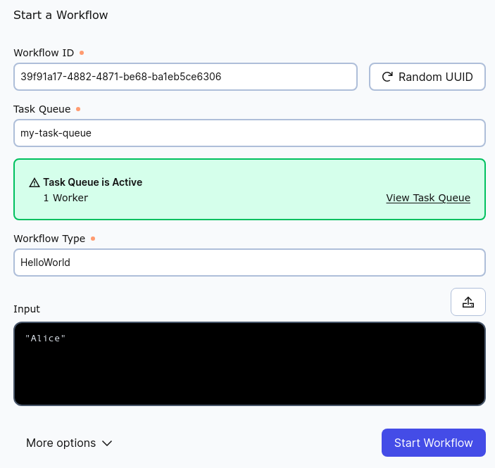
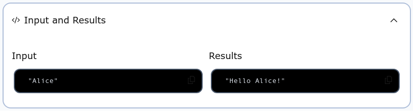

# Create, Configure, and Run a Worker

In this section we will learn first how to create a Temporal Worker, next how to configure it, and then how to start it running.  Finally we will package these actions into a complete program that you can run from the command line.  The first step is Worker creation.

To follow along with this section, use the following two imports:

```scala
import zio.temporal.worker.*
import zio.temporal.workflow.*
```

## Create the Worker

As mentioned earlier, when using Temporal, your Workflow logic is executed by a [Temporal Worker](https://docs.temporal.io/workers).  Therefore, to do any workflow work you must create and configure at least one Worker.  Workers are constructed by a factory.  The tools that ZIO-Temporal gives you for this are [`ZWorker`](https://zio-temporal.vhonta.dev/api/zio/temporal/worker/ZWorker) and [`ZWorkerFactory`](https://zio-temporal.vhonta.dev/api/zio/temporal/worker/ZWorkerFactory$).

`ZWorkerFactory` is the name of a Scala class, but also of that class’ companion object, which you can use without the need to construct an instance. This singleton object has a method [`newWorker()`](https://zio-temporal.vhonta.dev/api/zio/temporal/worker/ZWorkerFactory$.html#newWorker(taskQueue:String,options:zio.temporal.worker.ZWorkerOptions):zio.URIO[zio.temporal.worker.ZWorkerFactory,zio.temporal.worker.ZWorker]) which serves to create a new Temporal Worker.  Invoking this `newWorker()` method will not create the new Worker, rather it returns a ZIO program that, when run, will create the Worker.

The only required parameter of this method is the name of the single Task Queue on the Temporal server to which the Worker will listen, which it accepts as a [`String`](https://docs.oracle.com/en/java/javase/17/docs/api/java.base/java/lang/String.html) value argument.  For example, if the name of your Task Queue is `"my-task-queue"`, then the correct expression is:

```scala
ZWorkerFactory.newWorker("my-task-queue")
```

This expression, when evaluated, does not do anything except map the Task Queue name into a ZIO program (a.k.a _ZIO effect_) that you can run later.  You can evaluate `newWorker("my-task-queue")` without worry that it will start anything running nor contact any external services.  It is a [pure function](https://docs.scala-lang.org/scala3/book/fp-pure-functions.html) without any side-effects.  The Scala type of this `newWorker()`function is:

```scala
String => ZIO[ZWorkerFactory, Nothing, ZWorker]
```

The value of the `String` type input parameter is the name of the Temporal Task Queue.  The output type, _i.e.,_ the Scala type of the value returned by evaluating `newWorker()` is:

```scala
ZIO[ZWorkerFactory, Nothing, ZWorker]
```

Recall the meaning of the three ZIO type parameters, from left to right:

1. The dependencies necessary for the ZIO program to run,
2. The types of possible errors that might arise while running, and
3. The type of the value returned if the program completes successfully.

Thus, looking at the type signature above, the final type parameter indicates that an object of this type is a ZIO program that returns an instance of the `ZWorker` class.  The middle type parameter indicates that this program cannot fail because there is no possible value of type `Nothing` that it can return as an error.  The first parameter indicates that in order to run, this program depends on an instance of the `ZWorkerFactory` class.

This dependency instance of `ZWorkerFactory` is different from the singleton companion object of the `ZWorkerFactory` class used to generate this program.  The companion object exists and is available now.  The dependency instance will be constructed as part of dependency injection when the ZIO program is run.

The ZIO runtime infrastructure provides the mechanisms for running a ZIO program and providing its dependencies, so we can create the program now, and worry about the dependencies when running it later.

This one-line program consisting of a single ZIO effect will only create a Worker.  Let us now expand the program to use that Worker.  The next step is to configure the newly-created Worker to support a Workflow.

## Configure the Worker

A Temporal Worker must be configured to know which Workflows it supports, because the Temporal server may be communicating with multiple Workers that work on Workflows of different types.  The Worker must know what types of Workflows it can work on.  For this configuration, there is a `ZWorker` singleton object method [`addWorkflow[]`](https://zio-temporal.vhonta.dev/api/zio/temporal/worker/ZWorker$.html#addWorkflow[I](implicitevidence$5:zio.temporal.workflow.ExtendsWorkflow[I]):zio.temporal.worker.ZWorker.AddWorkflowAspectDsl[I]).  This method requires one argument, but it requires not a value argument but rather a _type argument_: the type of the class that implements the interface of the Workflow that the Worker is to support.

Recall that a Temporal Workflow definition comprises (1) an annotated Scala trait that declares the Workflow methods, and (2) a class that implements those methods.  When you want to invoke methods of your Workflow, rather than constructing an instance of the Workflow class yourself, the Temporal library will do it for you and give you a proxy stub that implements the Workflow trait.  You can invoke methods on that stub and the Temporal infrastructure will forward the invocation to the Temporal server, to a Queue, from where a Worker will pick it up and then invoke the method on a real instance of your implementing class (which might be running on a different machine than the stub).

All this happens behind the scenes so you need not worry about it; to you it’s as if you are working directly with an instance of the Workflow class.  But in order for all this to happen, the Worker must be configured with the type of that Workflow class.  The `addworkflow[]` method is the way to do this configuration.

In the previous section we defined a Workflow comprising a trait named `HelloWorld` and an implementing class `HelloWorldImpl`:

```scala
@workflowInterface
trait HelloWorld:

  @workflowMethod
  def apply(name: String): String

class HelloWorldImpl extends HelloWorld:

  override def apply(name: String) = s"Hello $name!"
```

The type of this implementing class, `HelloWorldImpl`, can be the type argument to the `ZWorker.addWorkflow[]` method:

```scala
ZWorker.addWorkflow[HelloWorldImpl]
```

The `@workflowInterface` annotation on the `trait` is the way that Temporal will know this represents a Workflow, and without that annotation, the `addWorkflow[]` method will fail.

There is one more step necessary to configure the Worker to support the Workflow, which is to tell it how it should construct instances of the Workflow `class`.  There are several ways to do this, but for this tutorial we can use the [`fromClass`](https://zio-temporal.vhonta.dev/api/zio/temporal/worker/ZWorker$$AddWorkflowAspectDsl.html#fromClass(implicitctg:scala.reflect.ClassTag[I],implicitisConcreteClass:zio.temporal.workflow.IsConcreteClass[I],implicithasPublicNullaryConstructor:zio.temporal.workflow.HasPublicNullaryConstructor[I]):zio.temporal.worker.ZWorker.Add[Nothing,Any]) method.  Simply apply `fromClass` to the object returned by `addWorkflow[]` like this:

```scala
ZWorker.addWorkflow[HelloWorldImpl].fromClass
```

This expression makes little sense without the Worker to which it applies, and as such the value returned by this expression is an _aspect_.  Aspect Oriented Programming (AOP) is [a vast subject](https://en.wikipedia.org/wiki/Aspect-oriented_programming) far beyond the scope of this tutorial, but in general an aspect is a “transformer” that modifies the behavior of its input in some well-defined way.  Here, this aspect is a transformer to modify a Worker by configuring it to handle Workflows of type `HelloWorld`.

Understand that the expression above does not return a `ZIO` instance, but rather a [`ZIOAspect`](https://javadoc.io/doc/dev.zio/zio_3/latest/zio/ZIOAspect$.html).  You apply a `ZIOAspect` to a `ZIO` using the [`@@`](https://javadoc.io/doc/dev.zio/zio_3/latest/zio/ZIO.html#@@-fffff765) operator.

So if we combine the invocations of `newWorker()` and `addWorkflow[]` like this:

```scala
ZWorkerFactory.newWorker("my-task-queue") @@ ZWorker.addWorkflow[HelloWorldImpl].fromClass
``` 

then we get an expression that, when evaluated, returns a ZIO program (effect) that will both (1) construct a new Temporal Worker, and (2) configure it to support the `HelloWorld` workflow definition.

So now we know how to construct a Worker and how to configure the Workflow it will support.  The only thing left is to start the Worker.

## Start the Worker Listening

We can start a Worker running, which means it is ready and waiting and listening to the Temporal server’s Task Queue for work to do.  If there are no work commands in the server Queue then the Worker will wait, listening until there are.

To start Workers we return to the `ZWorkerFactory` class.  It is the `ZWorkerFactory` instance that starts Workers running.  The [`ZWorkerFactory.start`](https://zio-temporal.vhonta.dev/api/zio/temporal/worker/ZWorkerFactory.html#start:zio.UIO[Unit]) method will create a ZIO effect to start all the Workers that were created by that factory.  The factory starts all its workers together at the same time, after which in can construct no more Workers.

As in the case of the `ZWorkerFactory.newWorker()` method described above, invoking `ZWorkerFactory.setup` has no side effects.  It is a pure function that returns a ZIO effect of this type:

```scala
ZIO[ZWorkerFactory & Scope, Nothing, Unit]
```

Looking at the type parameters of this `ZIO` object, the final parameter indicates that this program, when run to success, will return the `Unit` object, of which there is only one instance.  Therefore the only information it provides is that the program finished without error.  The second parameter, `Nothing`, as in the case of the effect that creates the Worker, indicates that this effect cannot fail.

The first parameter is a Scala intersection type, which represents multiple types, in this case `ZWorkerFactory` and `Scope`.  This means that this ZIO program has two dependencies, one each of those two types.  The dependency on a `ZWorkerFactory` is obvious because it is the `ZWorkerFactory` that starts Workers.  A [`Scope`](https://javadoc.io/static/dev.zio/zio_3/2.1.9/zio/Scope.html) is an object that can hold finalizers for resources that must be released, for example closing a file or database connection.  In this case, a Worker is a resource that must be stopped safely.  By providing this program with a `Scope` instance, ZIO will be able to shut down Workers at the right time.

Now we have two ZIO effects, the first for configuring a Worker, generated by evaluating this expression:

```scala
ZWorkerFactory.newWorker("my-task-queue") @@ ZWorker.addWorkflow[HelloWorldImpl].fromClass
```
    
and the second for starting the Worker by this:

```scala
ZWorkerFactory.setup
```

The types of these two ZIO effects are, respectively:

```scala
ZIO[ZWorkerFactory, Nothing, ZWorker]
ZIO[ZWorkerFactory & Scope, Nothing, Unit]
```

We can compose these into a single ZIO program using a Scala [`for` expression](https://docs.scala-lang.org/scala3/book/taste-control-structures.html#for-expressions):

```scala
for
  _ <- ZWorkerFactory.newWorker("my-task-queue") @@ ZWorker.addWorkflow[HelloWorldImpl].fromClass
  _ <- ZWorkerFactory.setup
yield ()
```

and the result of evaluating that `for` expression will be a new ZIO program that both configures a new Temporal Worker and starts it running, in that order.  The type of this composed ZIO program is:

```scala
ZIO[ZWorkerFactory & Scope, Nothing, Unit]
```

because the all dependencies of the two effects are combined into the dependencies of the composed effect (`ZWorkerFactory & Scope`), neither effect can raise an error (`Nothing`), and the return value upon completion is `()` (the `Unit` value).

In the generators of this `for` expression, the underscore characters to the left of `_ <-` indicate that we are ignoring the values returned when each `ZIO` is run.  The `ZWorker` returned by the first ZIO can be ignored, because the `ZWorkerFactory` will handle starting and stopping it.  The `Unit` returned by the second can be ignored because it only indicates that the program completed successfully, which is already known by the program’s completion.

Now that we know how to create a Worker, configure it, and start it running, let’s package that code into a complete ZIO application that can be run using a shell command.

## Run the Worker From the Command Line

We have talked about running a ZIO effect, but we have yet to run any of our ZIO instances.  In this section we will run them as a program.

The program we are assembling now looks like this:

```scala
for
  _ <- ZWorkerFactory.newWorker("my-task-queue") @@ ZWorker.addWorkflow[HelloWorldImpl].fromClass
  _ <- ZWorkerFactory.setup
yield ()
```

There is a problem with running this program because, when run, the `ZWorkerFactory.setup` effect will return, the enclosing scope will exit, and ZIO’s resource-management infrastructure will cause the Workers to be shut down.  In order to keep the Workers running, we will add one line to prevent exiting the scope:

```scala
for
  worker <- ZWorkerFactory.newWorker(taskQueue) @@ ZWorker.addWorkflow[HelloWorldImpl].fromClass
  _      <- ZWorkerFactory.setup
  _      <- ZIO.sleep(Duration.Infinity)
yield ()
```

`ZIO.sleep(Duration.Infinity)` returns an effect that suspends execution indefinitely without blocking the executing fiber.  To interrupt the program we can type `Control-c` and the Workers will be shut down safely.

Now the program contents are complete and we have only to run it with its required dependencies.  ZIO provides the means to do this through the [ZIOAppDefault](https://javadoc.io/doc/dev.zio/zio_3/latest/zio/ZIOAppDefault.html) trait.  This trait declares a member `run` that will be run as a ZIO effect when the Scala project is run (by sbt or otherwise).  For example, given an object that extends `ZIOAppDefault`, if our program is a value named `program`:

```scala
val program =
  for
    worker <- ZWorkerFactory.newWorker(taskQueue) @@ ZWorker.addWorkflow[HelloWorldImpl].fromClass
    _      <- ZWorkerFactory.setup
    _      <- ZIO.sleep(Duration.Infinity)
  yield ()
```

then `program` can be the definition of that object’s `run` member:

```scala
object ServerMain extends ZIOAppDefault:

  override val run = program
```

There is still something missing, and that is providing the dependencies.  Recall the type of `program` is

```scala
ZIO[ZWorkerFactory & Scope, Nothing, Unit]
```

so it needs a `ZWorkerFactory` and a `Scope` to run.  Conveniently, `ZIOAppDefault` will provide a `Scope`, so we need provide only some of the dependencies.  For this, ZIO instances have a method `provideSome[]()`, whose type parameter is the intersection of all dependency types that are **not** given as a value argument.  Since we will let `ZIOAppDefault` provide the `Scope` we can pass `Scope` as the type argument to `provideSome[]()` and omit any instance of that type as a value argument.  Therefore our invocation of `provideSome[]()` will look like:

```scala
provideSome[Scope](???)
```

Where `???` will be all the dependencies that we do provide.  In fact you can leave the value parameter list empty and the Scala compiler will helpfully tell you which dependencies are missing.  This is valuable here, because although we know we must provide a `ZWorkerFactory`, it turns out that `ZWorkerFactor` has its own dependencies.  `ZWorkflowClient` and `ZWorkflowServiceStubs` are necessary for connecting to the Temporal server.

In addition to these three types, each requires a configuration object, whose corresponding name is the same with `Options` appended.


The complete list of dependency types this program needs (besides `Scope`) is:

* `ZWorkerFactory`
* `ZWorkerFactoryOptions`
* `ZWorkflowClient`
* `ZWorkflowClientOptions`
* `ZWorkflowServiceStubs`
* `ZWorkflowServiceStubsOptions`

If we wanted to customize the configuration of these dependencies, we could do so here.  Since this is a simple tutorial we will use the defaults.  The companion objects of all of these types provide instances in the form of _layers_, which are constructed using the `make` method.  For example, to construct a layer containing an instance of `ZWorkerFactoryOptions`, simply use:

```scala
ZWorkerFactoryOptions.make
```

Knowing the names of all the dependencies, just invoke `make` on the companion object to each and pass them all as a list of values to the `provideSome[]()` method like this:

```scala
program.provideSome[Scope](
  ZWorkflowClientOptions.make,
  ZWorkflowClient.make,
  ZWorkerFactoryOptions.make,
  ZWorkerFactory.make,
  ZWorkflowServiceStubsOptions.make,
  ZWorkflowServiceStubs.make,
)
```

Overriding the `run` member of `ZIOAppDefault` with the value of `program` now will succeed because `program` has all its dependencies provided.

### The Complete Program Source

All of the ZIO and ZIO-Temporal types we have used in this section are in the `zio.*`, `zio.temporal.*`, `zio.temporal.worker.*` and `zio.temporal.workflow.*` packages.  Therefore, a source file that imports those packages and contains the rest of our code will be a working ZIO application that starts a Temporal Worker:

```scala title="src/main/scala/ServerMain.scala"
import zio.*
import zio.temporal.worker.*
import zio.temporal.workflow.*

@workflowInterface
trait HelloWorld:

  @workflowMethod
  def apply(name: String): String

class HelloWorldImpl extends HelloWorld:

  override def apply(name: String) = s"Hello $name!"

object ServerMain extends ZIOAppDefault:

  val program =
    for
      worker <- ZWorkerFactory.newWorker("my-task-queue")
                  @@ ZWorker.addWorkflow[HelloWorldImpl].fromClass
      _      <- ZWorkerFactory.setup
      _      <- ZIO.sleep(Duration.Infinity)
    yield ()

  override val run =
    program.provideSome[Scope](
      ZWorkflowClientOptions.make,
      ZWorkflowClient.make,
      ZWorkerFactoryOptions.make,
      ZWorkerFactory.make,
      ZWorkflowServiceStubsOptions.make,
      ZWorkflowServiceStubs.make,
    )
```

## Start a Workflow With the GUI

Let’s try using our Worker.  If you have not yet started the Temporal server (and you [installed](https://learn.temporal.io/getting_started/java/dev_environment/#set-up-a-local-temporal-service-for-development-with-temporal-cli) it), then you can start it with the command 

```bash
temporal server start-dev
```

Your web browser should be able to access the management GUI on [localhost port 8233](http://localhost:8233/namespaces/default/workflows).  **The Temporal server must be accessible for the Worker to start.**

When the Temporal server is running (in one terminal session), run the Scala Worker application (in a different terminal session):

```bash
sbt run
```

There is not much terminal output, but you can confirm that the Worker has connected to the Task Queue by pointing your browser at a [URL that looks like this](http://localhost:8233/namespaces/default/task-queues/my-task-queue):

```
http://localhost:8233/namespaces/default/task-queues/my-task-queue
```

where the final path segment is the name of the Task Queue that was passed as the argument to the `ZWorkerfactory.newWorker()` method in the Scala program.

Now that the Worker is running, try to start a Workflow using the Temporal web GUI.  Look for the [](http://localhost:8233/namespaces/default/workflows/start-workflow) button near the upper right of the GUI window.  Clicking it will bring you to a form into which you can enter the Workflow details.



Every Workflow Execution must have a unique Workflow ID.  The form can generate a random UUID for you or you can choose any you like.  In the "Task Queue" field enter the same value passed to the `ZWorkerFactory.newWorker()` method.  In the "Workflow Type" field enter the name of the trait of the Workflow Definition.  In the "Input" field provide the text string that will be passed as the argument to the `HelloWorld()` method.  This argument is interpreted as JSON, and therefore because it is a String it must be enclosed in double quotation marks: `"`.  (If it were a number it would not need the quotation marks.

When you have completed the form, submit it by clicking the "Start Workflow" button in the lower right of the window.  If you have done all correctly you will be taken to a list of all Workflows (which may be only this one).  Clicking on the Workflow ID will bring you to a detail page for the Workflow Execution you just started.  Expand the "Input and Results" section and you will see the text you entered into the form and the output result from executing the Workflow.



This experience shows you that you have sent an input argument through the Temporal server, causing the Workflow you defined to be applied to that argument by a Worker running in the Scala application, and you have seen that the result has been returned back to the Temporal server.  Of course in a production application you will not be starting Workflows using the management GUI, so the next section of this tutorial will teach you how to start Workflow Executions programatically in Scala.
