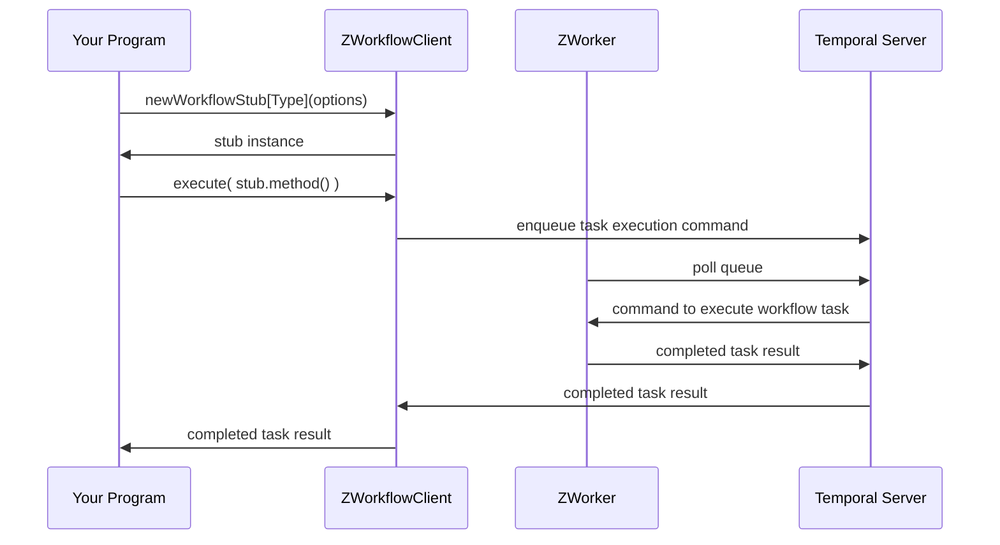

# Execute a Workflow

Starting a Temporal Worker running is a bit like running a web server, such as Nginx or Apache.  The server process can be running, but if nobody requests a web page then it’s hardly doing anything useful.  Similarly, a Temporal Worker can be running, standing by ready to do work, but until it receives instructions to execute a Workflow, it’s hardly doing anything useful.  The flip-side of starting a Worker is executing a Workflow.

In the previous section we created a Temporal Worker and started it running.  Then we caused it to execute a Workflow by sending a command through the Temporal management GUI web-page.  In this section we will use the same Worker to execute the same Workflow, but this time we will start the Workflow Execution from Scala code using the ZIO-Temporal library.

Here is a simplified version of the process of programmatically executing a Temporal Workflow:



If you focus on what your program does in this diagram, it’s quite simple; only two things:

1. Acquire a stub instance of the Workflow trait, and
2. Execute the method that starts the Workflow.

Everything else in the diagram happens automatically, and this automatic process can do even more for you when there are problems that Temporal hides from you, for example automatically retrying tasks in the case of intermittent failures.

So once you know how to take these two simple steps you will be able to write a program that starts a Workflow execution.  The first step is to aquire a stub instance of your Workflow trait.

## Invoke the Workflow Method on the Stub, Not on the Implementation

Recall that a Workflow Definition is a trait and an implementing class.  The trait declares, and the class defines, the method that will start the Workflow Execution.  This trait and method are annotated for Temporal to identify them as defining a Workflow.  In our running example, the Workflow type is `HelloWorld`:

```scala
@workflowInterface trait HelloWorld:
  @workflowMethod def apply(name: String): String

class HelloWorldImpl extends HelloWorld:
  override def apply(name: String) = s"Hello $name!"
```

Looking at the sequence diagram above, see that your program acquires a stub instance by invoking the [`newWorkflowStub[]()`](https://zio-temporal.vhonta.dev/api/zio/temporal/workflow/ZWorkflowClient#newWorkflowStub[A](workflowId:String,runId:Option[String])(implicitevidence$5:scala.reflect.ClassTag[A],implicitevidence$6:zio.temporal.workflow.IsWorkflow[A]):zio.UIO[zio.temporal.workflow.ZWorkflowStub.Of[A]]) method on a `ZWorkflowClient` instance.

We write `newWorkflowStub[]()` with the square brackets and parentheses to indicate that this method takes both a type parameter and a value parameter.  The type parameter is the type of the Workflow to be executed, and the value parameter specifies the configuration options for the Workflow.  The type of our example Workflow is `HelloWorld`, therefore we obtain a stub for it with an invocation of the form `newWorkflowStub[HelloWorld]()`, which will return an object of type:

```scala
ZIO[Any, Nothing, ZWorkflowStub & HelloWorld]
```

As before, we can understand this ZIO effect type by inspecting its three type parameters.  The first type parameter, the required dependencies, is `Any`.  If any type can satisfy the requirement then effectively there is no requirement, and thus this means that there are no dependencies required to run this effect.

The error type of `Nothing` we have seen before; it tells us that this effect cannot return an error.  In other words, if the effect completes, then it must complete successfully by returning a value of the third type: `ZWorkflowStub & HelloWorld`.

This type returned upon successful completion is a [Scala intersection type](https://docs.scala-lang.org/scala3/book/types-intersection.html).  Such types, indicated by the ampersand (`&`) character, we have already encountered.  An object of type `ZWorkflowStub & HelloWorld` implements _both_ the trait of the Workflow Definition, as well as of the [`ZWorkflowStub`](https://zio-temporal.vhonta.dev/api/zio/temporal/workflow/ZWorkflowStub) trait, which adds several useful methods.

Although this stub makes our development easier by providing an object with the trait we created, we cannot just invoke the trait’s methods as we would in a non-Temporal program.  Because the execution process goes through the Temporal infrastructure, we must execute it using the [`execute()`](https://zio-temporal.vhonta.dev/api/zio/temporal/workflow/ZWorkflowStub$.html#execute[R](f:R):zio.temporal.TemporalIO[R]) method provided by the [`ZWorkflowStub`](https://zio-temporal.vhonta.dev/api/zio/temporal/workflow/ZWorkflowStub$) companion object.

Given a value named `workflowStub` of type `ZWorkflowStub & HelloWorld`, the invocation of `execute()` could look like this:

```scala
ZWorkflowStub.execute(workflowStub("Alice"))
```

where `"Alice"` is the input value to our workflow.  In the pattern we have seen repeatedly in this tutorial, methods that return ZIO objects are pure functions with no side effects.  Even though this method is named `execute()`, invoking it does not start the execution, it merely creates a ZIO effect that will start the execution later when it is run.  The `execute()` method returns an object of type:

```scala
ZIO[Any, TemporalException, String]
```

The first type parameter, `Any`, as already explained, means this ZIO effect can be run without any dependencies.  The second parameter indicates that when run, this effect might fail with an error of type [`TemporalException`](https://www.javadoc.io/doc/io.temporal/temporal-sdk/latest/io/temporal/failure/TemporalException.html), which is the base class for all exceptions thrown by the Temporal SDK.

The final type parameter, `String` is the the type of value that will be returned by this effect if it completes successfully, but where does it come from?  It is the return type of the workflow method that `execute()` will execute.  We declared the Workflow method `apply()` as:

```scala
def apply(name: String): String
```

Because the Workflow Method returns a `String`, the ZIO effect created by evaluating `ZWorkflowStub.execute(HelloWorld())` will therefore, when completing successfully, return a `String`.

Alternatively, if `apply()` were declared as:

```scala
def apply(name: String): Int
```

Then evaluating this expression:

```scala
ZWorkflowStub.execute(workflowStub("Alice"))
```

would return an object with this type:

```scala
ZIO[Any, TemporalException, Int]
```

## Acquire a Stub and Execute a Workflow in a Single Effect

In the previous section  we saw how to use a Scala `for` expression to compose two ZIO effects into one.  We can do that here to compose the effect that acquires the Workflow stub with the effect that uses the stub to execute the Workflow.  The value returned by the `for` expression is a new effect that can do both:

```scala
for
  helloWorld <- client.newWorkflowStub[HelloWorld](workflowOptions)
  result     <- ZWorkflowStub.execute(helloWorld("Alice"))
yield result
```

There is a difference in this `for` expression from the one we saw earlier.  We already know that on each generator line in a `for` expression, the expression on the right of the `<-` is some kind of “container” of a value we are interested in, and the name on the left of the `<-` represents that value “unwrapped” from the container.  The meanings of “container” and “unwrap” depend on the specific containing type.  In the case of a ZIO effect, unwrapping means to run the effect, and the returned value is what is contained.

In the `for` expression in the previous section we ignored the contained values because we had no need to use them.  That earlier composed `for` expression itself returned a ZIO effect containing the `Unit` value, as determined by the last line `yield()`.

In this case, however, we _do_ care about the contained values: we care about the value that is the Workflow stub contained in the first effect, because we need it to execute the Workflow.  And we care about the value returned by the Workflow Execution, which is contained in the second effect, because that is the value to be returned to the user who runs the application.  The value returned by the second effect is what the composed effect will return.  The Workflow stub is needed only to execute the Workflow and can be discarded after having been used for that purpose.

In the `for` expression here, `helloWorld` to the left of `<-` on the first generator line represents the stub value that will be returned by the first effect when it is run, and the second generator specifies that when that stub instance will be available, its `apply()` method is to be invoked by the `ZWorkflowStub.execute()` method.

The `result` to the left of the `<-` on the second generator line represents the Workflow return value returned by the second effect, and is specified to be the value contained in the composed effect in the closing line `yield result`.

The type of the composed effect resulting from this two-generator `for` expression will be:

```scala
ZIO[Any, TemporalException, String]
```

The first type is `Any` because both of the composed effects have a first type parameter of `Any`.  The second type is `TemporalException` because one of the two composed effects has that error type, meaning the composed effect might fail with that same error type.  The third parameter is `String` because that is the type of value `result` in `yield result`.

But this `for` expression is not yet complete.  It refers to two variables that must be supplied:

1. `client`, an instance of [`ZWorkflowClient`](https://zio-temporal.vhonta.dev/api/zio/temporal/workflow/ZWorkflowClient), which has the `newWorkflowStub[]()` method, and
2. `workflowOptions`, an instance of [`ZWorkflowOptions`](https://zio-temporal.vhonta.dev/api/zio/temporal/workflow/ZWorkflowOptions), which `newWorkflowStub[]()` requires as a value parameter.

Let’s look at the Workflow options first.

## Configuring the Workflow Execution Options

Looking again at the sequence diagram above, the whole process of executing a Workflow is complex and certain parameters must be explicitly set; relying completely on defaults is not possible here.  The two required parameters are the name of the Task Queue, and the identifier for this Workflow Execution.

These are the same parameters you supplied when starting the Workflow through the Temporal web GUI.  Into that form you supplied the Workflow ID, Task Queue name, Workflow Type, and Workflow input.  The Workflow Type (`HelloWorld`) and the Workflow input (`"Alice"`) are already part of our `for` expression.  The other two parameters we will provide in the `workflowOptions` object, which we can construct like this:

```scala
ZWorkflowOptions
  .withWorkflowId(workflowID)
  .withTaskQueue("my-task-queue")
```

The [`ZWorkflowOptions`](https://zio-temporal.vhonta.dev/api/zio/temporal/workflow/ZWorkflowOptions$) singleton object gives us the [`withWorkflowId()`](https://zio-temporal.vhonta.dev/api/zio/temporal/workflow/ZWorkflowOptions.html#withWorkflowId(value:String):zio.temporal.workflow.ZWorkflowOptions) method, which returns an object with the [`withTaskQueue()`](https://zio-temporal.vhonta.dev/api/zio/temporal/workflow/ZWorkflowOptions$$SetTaskQueue.html#withTaskQueue(value:String):zio.temporal.workflow.ZWorkflowOptions) method.

We used the Task Queue name already when we started the Worker.  Each Worker listens to exactly one Task Queue, so the name provided when executing a Workflow must match the name used when constructing the Worker that is to perform the execution.  The name is a `String` value.

Besides the Task Queue name, a Workflow Execution must be configured with a unique identifier.  Once one Workflow Execution uses an identifier, that identifier cannot be used again.  The web GUI has a button to generate a random identifier.  In this program we must generate our own `workflowID` as a unique value every time the code is run.

It’s a good idea to use Workflow identifiers that distinguish Workflow Executions of one type from those of others.  Let’s use an identifier consisting of the word `"hello"` and the current time.  If the variable `time` is bound to a value representing the current time, for example of type [`OffsetDateTime`](https://docs.oracle.com/en/java/javase/17/docs/api/java.base/java/time/OffsetDateTime.html), then this assignment:

```scala
workflowID = s"hello-$time"
```

will define a `String` variable whose value is an informative and unique indentifier for a Workflow Execution.

But where do we get the `time`?  We could use the Java standard library to get the current system time, but when programming with ZIO we have another option.  One problem with using a non-deterministic method that returns a different value with each invocation is that it makes testing more complicated, because the result of such a method might raise an error in one test run and then be unreproducable later.

To avoid this situation, ZIO provides some services that can behave as expected when running in production, but that come with test implementations that can produce the same values every time they are invoked.  One such service is [`Clock`](https://javadoc.io/doc/dev.zio/zio_3/latest/zio/Clock$.html), which has a [`currentDateTime`](https://javadoc.io/static/dev.zio/zio_3/2.1.9/zio/Clock$.html#currentDateTime-63f) method that returns a

```size
ZIO[Any, Nothing, OffsetDateTime]
```

This is a `ZIO` object, and so we can add the `currentDateTime` invocation to the `for` expression that will start the Workflow Execution:

```scala
for
  time       <- Clock.currentDateTime
  ???
  helloWorld <- client.newWorkflowStub[HelloWorld](workflowOptions)
  result     <- ZWorkflowStub.execute(helloWorld("Alice"))
yield result
```

`newWorkflowStub[]()` in the second generator needs `workflowOptions`.  Constructing `workflowOptions` requires the Workflow identifier, which in-turn requires value of the `time`.  `currentDateTime` in the first generator provides that.  There are several ways to incorporate the `workflowOptions` creation into this `for` expression.  For example, here is one way:

```scala
for
  time       <- Clock.currentDateTime
  helloWorld <- client.newWorkflowStub[HelloWorld](
                  ZWorkflowOptions
                    .withWorkflowId(s"hello-$time")
                    .withTaskQueue("my-task-queue")
                )
  result     <- ZWorkflowStub.execute(helloWorld("Alice"))
yield result
```

Another way is to include separate definition lines in the `for` expression like this:

```scala
for
  time       <- Clock.currentDateTime
  workflowID      = s"hello-$time"
  workflowOptions = ZWorkflowOptions
                      .withWorkflowId(workflowID)
                      .withTaskQueue("my-task-queue")
  helloWorld <- client.newWorkflowStub[HelloWorld](workflowOptions)
  result     <- ZWorkflowStub.execute(helloWorld("Alice"))
yield result
```

You may find one way more readable than the other.  Which you prefer is a matter of style.  Either way, we now have the `ZWorkflowOptions` instance that the `ZWorkflowClient` needs in the second generator line.  Next, we will see how to acquire that `ZWorkflowClient` instance.

## Accessing a Dependency Service


[`ZWorkflowClient`](https://zio-temporal.vhonta.dev/api/zio/temporal/workflow/ZWorkflowClient) is a dependency to be injected into this program.  We see an instance of this type named `client` used in the `for` expression where its `newWorkflowStub[]()` method is applied to the Workflow type and execution options.  `ZWorkflowClient` is a type included in the ZIO-Temporal library, and later we will see how to provide it to the program.  In the context of the code we are working on here, we can just pluck an instance out of the context of the `for` expression so that it will be in scope when needed for the `newWorkflowStub[]()` method.  The means for this is the [`ZIO.serviceWithZIO[]()`](https://javadoc.io/doc/dev.zio/zio_3/latest/zio/ZIO$.html#serviceWithZIO-ecf) method.

`ZIO.serviceWithZIO[]()` takes a type parameter and a value parameter.  The type parameter is that of a dependency to be injected, in this case `ZWorkflowClient`.  The value parameter is a function whose input parameter is the dependency and whose return value is the effect that will use that dependency, in this case the `for` expression that starts the Workflow Execution.

To be specific: recall that we have a `for` expression that contains an undefined variable `client`:

```scala
for
  ???
  helloWorld <- client.newWorkflowStub[HelloWorld](workflowOptions)
  ???
yield result
```

We will define a function with a parameter of type `ZWorkflowClient`.  The return value of this function will be the `for` expression, which can use that parameter as the value of `client`:

```scala
client => for
  ???
  helloWorld <- client.newWorkflowStub[HelloWorld](workflowOptions)
  ???
yield result
```

We pass this function as the single argument to the `serviceWithZIO[]` method:

```scala
ZIO.serviceWithZIO[ZWorkflowClient]: client =>
  for
    time            <- Clock.currentDateTime
    workflowID      = s"hello-$time"
    workflowOptions = ZWorkflowOptions
      .withWorkflowId(workflowID)
      .withTaskQueue("my-task-queue")
    helloWorld      <- client.newWorkflowStub[HelloWorld](workflowOptions)
    result          <- ZWorkflowStub.execute(helloWorld("Alice"))
  yield result
```

The type returned by this invocation of `serviceWithZIO[ZWorkflowClient]` is:

```scala
ZIO[ZWorkflowClient, TemporalException, String]
```

The type of the inner `for` expression is:

```scala
ZIO[Any, TemporalException, String]
```

By applying `serviceWithZio[]` to the `for` expression, we added the `ZWorkflowClient` dependency to the effect type, and now the ZIO infrastructre will ensure that this dependency is available to the program at compile time.

Next, consider that the input value to this workflow (`"Alice"`) is hard-coded in the `for` expression.  Let’s instead use a command-line argument to provide that value for the Workflow Execution.

## Depend On a Value That Is Not a ZIO Service

We just saw an example of how the ZIO dependency injection features give our program access to a necessary ZIO service, in that case a `ZWorkflowClient`.  Sometimes our program needs a value that is not provided by a ZIO library.  In this case we need a user-provided `String` that will be the input value to the Workflow Execution.  We can get this even more easily than when using `serviceWithZIO[]`.

Recall, the type returned by the `serviceWithZIO[]` invocation above is:

```scala
ZIO[ZWorkflowClient, TemporalException, String]
```

Now we will define a function that returns this type and has an input type of `String`:

```scala
String => ZIO[ZWorkflowClient, TemporalException, String]
```

The value to be returned by this function we will define as the `serviceWithZIO[]` expression above, using the value of the function’s input `String` as the argument to `execute(HelloWorld())`.  Let’s call this function `invokeWorkflow`, and the input parameter `name`:

```scala
val invokeWorkflow = (name: String) =>
  ZIO.serviceWithZIO[ZWorkflowClient]: client =>
    for
      ???
      result <- ZWorkflowStub.execute(helloWorld(name))
    yield result
```

We can apply this function `invokeWorkflow()` to any `String` value to get a runnable ZIO effect that passes that `String` as the input value to the Workflow Execution.  The [`ZIOAppArgs`](https://javadoc.io/doc/dev.zio/zio_3/latest/zio/ZIOAppArgs$.html#) object, part of the ZIO library, gives us a way to get a `String` from the command-line that ran the program: the [`getArgs`](https://javadoc.io/static/dev.zio/zio_3/2.1.9/zio/ZIOAppArgs$.html#getArgs-63f) method.

This `getArgs` method returns a ZIO effect, and therefore we could have included it in the `for` expression we constructed above.  However, to keep the user input/output separate from the Workflow execution, we will make a different `for` expression to create a ZIO effect that (1) gets the command-line argument, (2) runs the Workflow execution effect, and (3) displays the results to the user.

## Write a Program the User Can Run

With the ZIO effect returned by the `for` expression above, we can give it a `String` input and it will return a `String` output.  We want to get our input `String` from the command line, which we can do using [`getArgs`](https://javadoc.io/static/dev.zio/zio_3/2.1.9/zio/ZIOAppArgs$.html#getArgs-63f).  `getArgs`, when invoked, returns a ZIO effect that returns a [`Seq[String]`](https://www.scala-lang.org/api/current/scala/collection/immutable/Seq.html), which is an ordered collection of `String` values.  If `chunk` is a value of type `Seq[String]` then `chunk(0)` returns the first element.  If a `Seq[String]` contains the values of command-line arguments, then the first element is the first command-line argument.

There are a couple ways to get at the first element of the `Seq[String]` when that `Seq[String]` is "contained" inside a ZIO effect.  In an earlier section, we saw that we can include variable definitions in a `for` expression by using `=` like this:

```scala
for
  args <- getArgs
  firstArg = args(0)
  ???
yield ()

```

We can also map a ZIO effect containing one value to an effect containing another value using a function that maps from the first to second value.  In our case, we have a `Seq[String]` and we want just the first `String` of the `Seq[]`.  A mapping function of type `Seq[String] => String` that will do this is:

```scala
args => args(0)
```

or, using more concise Scala syntax:

```scala
_(0)
```

If a `ZIO` instance contains a `Seq[String]`, then applying its `map()` method to this function will return a new `ZIO` containing the first `String` of that input `Seq[String]`.  For example:

```scala
getArgs.map(_(0))
```

returns a ZIO effect containing the first command line argument.  Therefore, an alternative to the previous `for` expression is:

```scala
for
  firstArg <- getArgs.map(_(0))
  ???
yield ()

```

You can choose one of these two styles, and of course there are other expressions that mean the same thing.  Which you prefer is a matter of your own style.

That takes care of this program’s input.  Printing the output value to the user’s console is so simple as to hardly merit discussion: use the [`Console.printLine()`](https://javadoc.io/doc/dev.zio/zio_3/latest/zio/Console.html#printLine-faf) method.

Knowing how to read the input and write the output, we can now write a three-line program that: (1) reads a name from the command line, (2) executes the Workflow with that name as input to the `invokeWorkflow()` function that we defined above, and (3) prints the result for the user:

```scala
val program = for
  name   <- getArgs.map(_(0))
  result <- invokeWorkflow(name)
  _      <- Console.printLine(result)
  yield ()
```

We have now covered everything needed to programmatically start a Workflow Execution.  The only other things needed in this source code file are: (1) the package imports, and (2) the ZIO service dependencies.  Both of these have been covered in earlier sections, and so the final Workflow Execution program is presented here without further explanation:

```scala
import zio.*
import zio.temporal.*
import zio.temporal.worker.*
import zio.temporal.workflow.*

object ClientMain extends ZIOAppDefault:

  val invokeWorkflow = (name: String) =>
    ZIO.serviceWithZIO[ZWorkflowClient]: client =>
      for
        time            <- Clock.currentDateTime
        workflowID      = s"hello-$time"
        workflowOptions = ZWorkflowOptions
          .withWorkflowId(workflowID)
          .withTaskQueue("my-task-queue")
        helloWorld      <- client.newWorkflowStub[HelloWorld](workflowOptions)
        result          <- ZWorkflowStub.execute(helloWorld(name))
      yield result

  val program = for
    name   <- getArgs.map(_(0))
    result <- invokeWorkflow(name)
    _      <- Console.printLine(result)
  yield ()

  override def run = program.provideSome[ZIOAppArgs & Scope](
    ZWorkflowClientOptions.make,
    ZWorkflowClient.make,
    ZWorkflowServiceStubsOptions.make,
    ZWorkflowServiceStubs.make,
  )
```

**Note:** this file excludes the `HelloWorld` Workflow Definition, since we compiled that along with the Worker code in an earlier section.  If you have the Workflow Definition in the same file as the code that starts the Worker, and that file is in the same SBT project as this file, then it’s unnecessary to include it here.  You can put all the code for this program and the Worker program and the Workflow Definition into a single file, or you can split them into three files, or combine them however you find most convenient.

With this program file saved, we are now ready to see it in action.

## Run The Workflow Execution Program

Two things are necessary for this program to succeed:

1. The Temporal server must be running and accessible, and
2. The Worker program we created in the previous section must be running.

Make sure those are both running, and then run this new program.  Pass a value on the command line as an argument to `run`.  If you run it from the shell, then you must enclose `run` and the argument in quotation marks in order for them to be passed as a single `sbt` argument, like this:

```bash
sbt "run Bob"
```

Alternatively, if you run from the prompt of an interactive `sbt` session then omit the quotes

```bash
run Bob
```

Because both the Worker-starting program and the Workflow-starting program are in the same SBT project, SBT will prompt you to choose one.  Choose the name of the object that extends `ZIOAppDefault`, which in this example is `ClientMain`.

If everything works then you will see `Hello Bob!` in your console where you entered the `sbt run` command.  You can also look at [the Temporal GUI website](http://localhost:8233/namespaces/default/workflows) to see the Workflow Execution, including the input and output values.

At this point you can try an experiment and see what happens if you start the Workflow when the Worker is not running.  Stop the Worker by keyboard interrupt, and then run the Workflow Execution program again.  The program will block your console, waiting for the result.  Look in the web GUI at the Workflow Execution.  You will see it in a "Running" state, and that the input is available but not the output.  Then run the Worker program.  The Workflow will complete and you will see the results in the terminal where you started it and also on the Workflow Execution page in the web GUI.

Now you have learned how to start a Workflow using ZIO-Temporal.  In the next section you will learn how to pass more complex arguments to a Workflow Execution.
